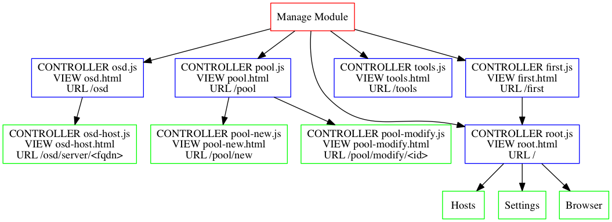

Manage
======
###General Theory of Operation

The manage application is the only module in calamari clients to modify the state of the Cluster. This is based on the Calamari 1.2 design which uses Salt Stack to manage the Ceph Cluster.

Salt favors an asynchronous communication model which uses 0mq to transmit requests and responses to it's minions.

Synchronous tasks immediately return with a 200 Status Code.
Asynchronous tasks respond with a 202 status code and a request_id in the payload.

The manage client polls the backend looking for pending tasks, if the request_id is still pending it waits 15 seconds. If the request_id is no longer pending it checks it's status and then posts a notification on the UI.

Architecture
------------

###Organization

Manage makes extensive use of RequireJS to handle dependencies and code loading. AngularJS apps can quickly become large and hard to manage code bases without some sort of organizational principle. RequireJS provides that infrastructure.

AngularJS uses a dependency injection model for configuring components. RequireJS makes defining those services a uniform and allows the safe side loading of additional JS libraries which Angular does not need to know about on a file by file basis.

The Application is partitioned into 4 AngularJS Modules. 

1. **manageApp** - the is the core of the Manage module itself
2. **APIModule** - Angular Service APIs used to communicate with the backend. This is mostly a thin wrapper around restangular.
3. **RequestModule** - An Angular Service for request id tracking. It consists of a singleton for tracking request_ids and reporting state once completed and a controller to display the current most recent task requests.
4. **NavbarModule** - An Angular controller for top most menu bar used to navigate the overall client application. This was ported from the Dashboard.

###Manage Organization

The URL map is very flat by design. There are no nested applications within Manage. The 4 areas of manage are Cluster, OSD, Pools and Logs.

####Controllers
Controllers are the core of an AngularJS application. Controllers are stateless and are reloaded everytime you navigate to a route in the application. Each controller is responsible for at least 1 view.

####Routing
Manage uses a basic ngRoute configuration. We take advantage of the template loading, store some extra keys in the RouteProvider, and make use of resolve, which prevents the page from loading until a promise a been resolved.

####Configuration Service
Manage tries to follow DRY principles and uses a basic configuration service to store and retrieve basic global values.

####Error Service
Manage has a special Error service which is used to handle Unauthorized errors globally and display a modal telling the user to log back in.

####Menu Service
A simple menu service is used to store the state of the submenu which allows navigation to the different submodules like OSD and Pool.

####Helpers
Some code was moved to helpers to slim down the individual controllers and encourage re-use and possibly enhance testability. There are two styles of helpers in Manage, functions which have no dependencies and functions which need runtime dependencies. We use a limited form of partial application to bind the runtime dependencies when the controller is initialized. Look for a function called `makeFunctions` as your entry point. This returns a handle with the methods you need to use bound using closure to the runtime dependencies.

Third Party Modules
--------------------

* [Restangular](https://github.com/mgonto/restangular) is our glue to the REST API. It has an expressive API for interfacing with RESTful style services.
* [Angular Strap](http://mgcrea.github.io/angular-strap/) is the UI toolkit we are using currently to wrap Twitter Bootstrap 3 and give us native AngularJS widgets rather than importing jQuery based code.

Structure
---------

####Use of promises

AngularJS has a custom version of [Kris Kowals Q](https://github.com/kriskowal/q) promise implementation embedded within it. Promises are  a very clean way of dealing with Asynchronous behavior in JavaScript. Promises help you with the [callback pyramid of doom](http://tritarget.org/blog/2012/11/28/the-pyramid-of-doom-a-javascript-style-trap/).

The other thing that's useful about promises is their immutability. Once a promise is complete, you can continue to complete against it as the result will never change. This is a very useful pattern for delaying operations until another component has finished a longer running task or initialized.

Promises are also very useful when you want to wait on a group of tasks to complete; for example network requests. They can also help with error handling in callbacks, which is often a messy and very frustrating affair which can be dealt with using a single handler if you use promises. Promises are so useful that they have been added to the ES6 spec and have already begun shipping in browsers like Chrome/Chromium.

####Two Level Routing

The manage app tries to maintain a policy of no deeper than two levels of routing URL. This is partially to not overload the ngRouter implementation and partially because it makes it easier to understand the structure. If more deeply nested or sophisticated application functionality is required, one would have to look at incoporating something like [AngularUIRouter](https://github.com/angular-ui/ui-router), which uses a state machine approach for building large Single Page Apps.

Start Up Issues
---------------
####Use of promises to avoid premature routing
The ClusterService is a special case within the Manage Module. It has a special call to an initialize() function that gets invoked as the first thing when bringing up the module. This initializes the cluster metadata using the first cluster returned by Calamari API. Other services within the APIModule use composition to depend on the ClusterService, therefore it is important that it runs to completion first before anything else.

We achieve this by returning a promise from initialize, which is only completed once the API call has successfully completed. ngRouter is designed to not allow navigation to pages within the app unless the promise returns as resolved.

Animation
---------
* Basic operation of ng-animate and limitations

Future Work
-----------
* Add Postal.JS to get an event bus

Open Issues
-----------
* Keeping Menus in sync with Dashboard
* Keeping Request Tracker in sync with Dashboard